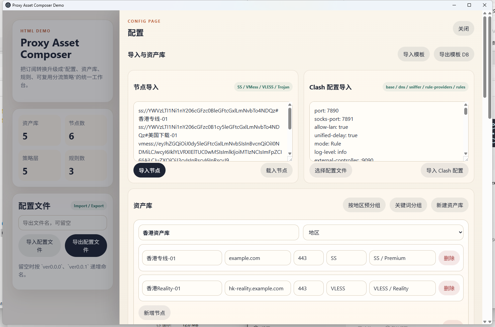

# Proxy Asset Composer

## 项目简介

`Proxy Asset Composer` 是一个面向代理配置编排的桌面原型工具。

它的目标不是只做“订阅转格式”，而是把节点、资产库、分流策略、规则、模板、配置文件导入导出放到同一个工作流里统一处理。

基于 `Electron + HTML/CSS/JavaScript` 实现

## 当前项目结构

- `app/`
  - 前端页面与交互逻辑
- `electron/`
  - Electron 桌面入口
- `dist/`
  - Windows 打包输出目录
- `package.json`
  - 桌面启动与打包配置

## 当前功能

### 1. 配置文件导入导出

- 支持从侧边栏直接导入本地 Clash 配置文件
- 支持从当前工作区导出配置文件
- 导出文件名支持自定义
- 如果未填写导出文件名，则自动按 `ver0.0.0`、`ver0.0.1` 递增命名

### 2. Clash 配置回填

- 支持导入完整 Clash 配置并回填当前页面状态
- 当前重点支持以下内容回填：
  - 基础配置头
  - `dns`
  - `sniffer`
  - `rule-providers`
  - `proxies`
  - `proxy-groups`
  - `rules`
- 导入时会以配置文件为主数据源，重建节点、资产库、策略组与规则

### 3. 节点导入

- 支持手动粘贴节点链接导入
- 支持在资产库内通过弹窗粘贴单个节点链接并加入对应资产库
- 当前可识别的协议包含：
  - `SS`
  - `VMess`
  - `VLESS`
  - `Trojan`
  - `Hysteria2`

### 4. 资产库管理

- 节点按资产库进行组织
- 支持新建资产库
- 支持编辑资产库名称与类型
- 支持编辑节点的：
  - 名称
  - 地址 / IP
  - 端口
  - 备注
- 节点协议为只读，保持导入时原始协议类型

### 5. 自动分组

- 支持按地区自动预分组
- 支持根据国家旗帜前缀自动归类，例如：
  - `🇺🇲` / `🇺🇸`
  - `🇬🇧`
  - `🇭🇰`
  - `🇹🇼`
  - `🇯🇵`
- 支持根据文字地区或地区缩写自动归类，例如：
  - `香港 / HK`
  - `美国 / US`
  - `英国 / UK`
  - `台湾 / TW`
  - `日本 / JP`
- 未能识别地区的节点会归入默认资产库

### 6. 关键词分组

- 支持通过弹窗将匹配到的节点归类到指定资产库
- 支持普通关键词匹配
- 支持启用正则表达式匹配
- 可用于把同地区、同运营商、同用途节点快速整理成单独文件夹 / 资产库

### 7. 分流策略编排

- 支持创建和编辑分流策略组
- 支持策略类型：
  - `手动选择`
  - `自动测速`
  - `故障转移`
  - `负载均衡`
- 每个策略组支持用“选项卡条目”方式编排成员
- 每个成员可以是：
  - 系统项：`DIRECT` / `REJECT`
  - 单个节点
  - 整个资产库
  - 其他分流策略

### 8. 策略引用逻辑

- 当策略引用其他策略时，导出时保留策略名，不做无意义拆包
- 当策略引用资产库时，会展开为资产库内节点
- 支持策略嵌套引用

### 9. 规则管理

- 支持查看和编辑 `Rules`
- 规则类型在操作页面中使用中文显示
- 当前支持的规则类型包含：
  - `域名后缀`
  - `域名关键词`
  - `完整域名`
  - `规则集`
  - `地理站点`
  - `地理 IP`
  - `IP 段`
  - `IPv6 段`
  - `进程名`
  - `目标端口`
  - `条件与`
  - `兜底匹配`
- 导出 Clash 配置时会自动转为原始英文规则名

### 10. Sniffer 与 Rule Providers 原文透传

- `Sniffer` 使用原文块方式编辑和导出
- `Rule Providers` 使用原文块方式编辑和导出
- 不做字段级强制转换，尽量保持原始结构

### 11. 模板导入导出

- 支持模板导出
- 当前模板导出内容只保留：
  - `sniffer`
  - `rule-providers`
  - `rules`
  - 被 `rules` 使用到的分流策略
- 模板不保存节点信息
- 模板中导出的分流策略统一使用 `DIRECT` 作为占位成员
- 当前模板导出文件扩展名为 `.db`
  - 这是当前原型阶段的结构化文件命名方式
  - 目前不是 SQLite 数据库

### 12. Clash 配置预览

- 预览内容包含：
  - 基础配置头
  - `dns`
  - `sniffer`
  - `rule-providers`
  - `proxies`
  - `proxy-groups`
  - `rules`
- 预览区域为固定范围
- 支持横向和纵向滚动
- 不会因为配置过长把页面整体撑宽

### 13. 校验提示

- 当策略引用不存在的节点、资产库或策略时，会给出错误提示
- 当节点信息不完整时，会给出错误提示
- 用于帮助检查配置回填和编排过程中的明显错误

## 桌面运行

### 安装依赖

```powershell
npm.cmd install
```

### 启动项目

```powershell
npm.cmd run start
```

## 打包

### 打包 Windows x64

```powershell
npm.cmd run dist:x64
```

### 打包 Windows ia32

```powershell
npm.cmd run dist:ia32
```

### 同时打包

```powershell
npm.cmd run dist:all
```

## 当前产物

当前项目已经可以生成 Windows 桌面可执行程序，主要产物位于：

- `dist/win-unpacked/`
- `dist/win-ia32-unpacked/`
- `dist/ProxyAssetComposer 0.0.1.exe`

## 当前限制

这个项目目前仍是原型验证版本，不是最终正式版。当前仍存在这些限制：

- 节点协议字段回填还没有覆盖所有协议的完整参数
- `proxies` 的复杂字段目前没有全部映射到可编辑 UI
- `proxy-groups` 只覆盖主要结构，未完整支持所有 Clash 扩展参数
- 模板 `.db` 目前是原型结构文件，不是真正数据库
- 当前仍以前端原型为主，尚未接入正式 Python 后端


## 说明

此项目基于当前 Demo 快速封装为桌面原型，主要用于确认产品模型、交互流程和配置编排逻辑是否符合需求。
